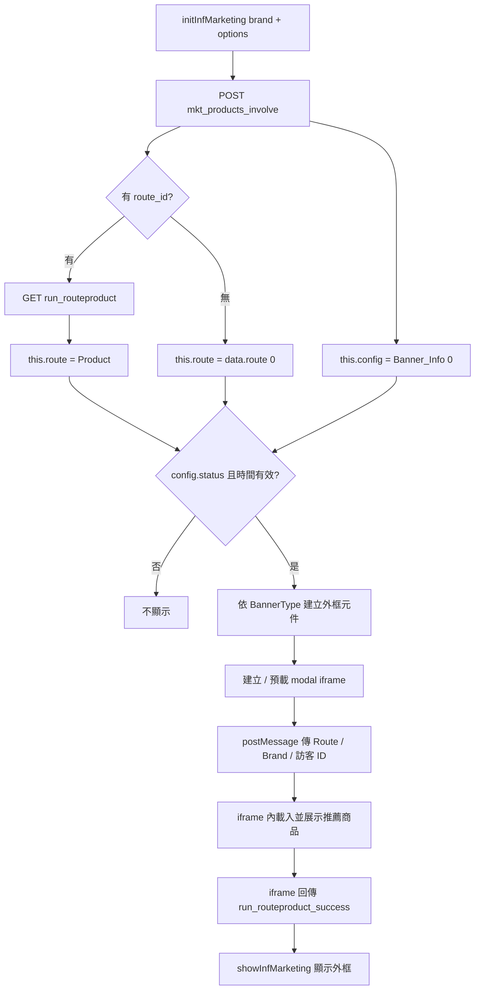

# 當前推薦商品邏輯說明

本文說明 `inf-marketing-all-in-one-component.js` 目前如何決定「要推薦哪一條動線／商品組合」，以及如何把結果交到前端 UI。

> 重點：本元件**不在父頁直接算推薦清單**，而是取得「動線（Route）」後，把 `Route` / `Brand` 等資訊交給 iframe；**實際商品列表與排序多半在 iframe 內完成**。

---

## 1. 入口

站外／品牌頁通常透過：

```js
Extensions_mkt_adv('OB91', {
  ga: 'G-XXXXXXXX',
  route_id: '2026-06-25-05-22-26-1', // 可選
  show_origin_price: true,            // 可選
  intro_mode: 'v2',                   // 可選；null | 'v1' | 'v2'；省略等同 null
  float_tooltip_text: '來試試 infFITS 個人化推薦購物！', // 可選；省略用預設文案；空字串則不顯示對話框
  enable_guide: true,                 // 可選；預設 false；true 才開啟遮罩引導
  enable_multi_route: false,           // 可選；預設 false；true 時浮動鈕對話框下方列出多動線選項
  lang: 'en'                           // 可選；iframe UI 語系：'zh-TW'（預設）| 'en'
});
```

最終會呼叫：

```js
window.initInfMarketing(brand, options)
```

再進入 `InfMarketingComponentManager.init(brand, url, config, iframeParams)`。

---

## 2. 總流程（高階）




---


## 3. 資料來源：兩支 API


### 3.1 行銷設定與預設動線

- **API**：`POST https://api.inffits.com/httpmpi/mkt_products_involve`
- **Body**：
  - `Brand`：品牌代碼（必填）
  - `url`：頁面網址（可選；未傳則用當前頁）
- **用途**：
  - 取 Banner 設定：`data.config.Banner_Info[0]` → `this.config`
  - 未指定 `route_id` 時，取預設動線：`data.route[0]` → `this.route`


### 3.2 指定動線商品（有 `route_id` 時）

- **API**：`GET .../extension/run_routeproduct?Brand=...&Route=...`
- **用途**：用回傳的 `Product` 作為動線物件：

```js
this.route = routeProduct.Product;
```

也就是：**指定** `route_id` **= 強制使用該動線的商品／展示設定**，不再用 `mkt_products_involve` 回傳的 `route[0]`。

---


## 4. 動線（`this.route`）如何決定


| 條件                   | 動線來源                                | 失敗行為                 |
| -------------------- | ----------------------------------- | -------------------- |
| 有 `options.route_id` | `run_routeproduct` 的 `Product`      | 沒有 `Product` → 中止初始化 |
| 無 `route_id`         | `mkt_products_involve` 的 `route[0]` | 沒有 `route` → 中止初始化   |


共通前提：

1. 仍需能取得 Banner 設定（API 的 `Banner_Info[0]`，或呼叫端傳入的 `options.config`）。
2. `config.status` 必須為開啟。
3. `TimeValid` 若有設定，必須落在有效日期區間。

`this.route` 常用欄位（由 API 決定）：

- `Route`：動線 ID（之後當成 iframe 的 `id` / `iframe-id`）
- `RouteDisplayMode`：決定載入哪一套 iframe

---


## 5. 展示模式 → iframe URL

`setupModalIframe()` 依 `this.route.RouteDisplayMode` 選 iframe：


| `RouteDisplayMode` | iframe                                                               |
| ------------------ | -------------------------------------------------------------------- |
| `media`            | `https://ts-iframe-v2.vercel.app/iframe_container_module.html`       |
| `nomedia-v2`       | `.../iframe_container_module.html?v=v2`（feature-ve-1140cc）          |
| 其他／預設              | `.../iframe_container_module.html?v=v1`（feature-ve-1140cc）          |


若有傳 `ga`，會附加到 iframe URL query。

> 註：`initInfMarketing` 的 JSDoc 寫「有 `route_id` 則 mode 固定 nomedia-v2」。程式實際仍依 `Product.RouteDisplayMode` 選 URL；若後端對指定動線固定回 `nomedia-v2`，效果上等價。

---


## 6. 父頁如何把「推薦上下文」交給 iframe

Modal 透過 `setIframeConfig` + `postMessage` 傳入：


| 欄位                        | 來源                                   | 意義                  |
| ------------------------- | ------------------------------------ | ------------------- |
| `id`                      | `this.route.Route`                   | 動線 ID（iframe 用來拉商品） |
| `brand`                   | `brand`                              | 品牌                  |
| `header`                  | 固定 `from_preview`                    | 訊息類型                |
| `MRID` / `GVID` / `LGVID` | `options` 優先，否則 `localStorage` 同名 key | 會員／訪客識別（可選）         |
| `show_origin_price`       | `options.show_origin_price === true` | 是否顯示原價              |
| `use_route_linked_tags`   | `options.use_route_linked_tags === true` | 是否開啟 RouteLinkedTags 過濾（省略或 false 則下一題仍顯示全部選項） |
| `intro_mode`              | `options.intro_mode`（`'v1'` / `'v2'`，其餘為 `null`） | 介紹模式；省略等同 null |
| `float_tooltip_text`      | `options.float_tooltip_text`（僅 FloatButton） | 浮動鈕上方對話框文案；省略用預設；空字串不顯示對話框；多動線模式省略時預設「選擇動線，或直接試試 AI 推薦動線」 |
| `enable_guide`            | `options.enable_guide === true`（僅 FloatButton） | 是否啟用遮罩引導（預設關閉；含父頁引導與 iframe 內教學） |
| `show_float_guide`        | `options.show_float_guide === true`（僅 FloatButton） | 強制顯示遮罩引導（需 `enable_guide`；忽略 `localStorage`） |
| `enable_multi_route`      | `options.enable_multi_route === true`（僅 FloatButton） | 多動線選擇（預設關閉；true 時對話框下方列出 `mkt_products_involve` 的 `route`） |
| `lang`                    | `options.lang`（`'zh-TW'` / `'en'` 及常見別名） | iframe UI 語系；父頁各元件透過 `ui-lang` 同步（Modal／Popup／Square card／FloatButton） |


父頁**不組裝商品陣列**；商品清單由 iframe 依 `id`（Route）向後端取用並渲染。

### 6.1 多動線選擇（`enable_multi_route`）

- **預設**：`false`（維持單一對話框＋打字機效果）
- **開啟時**：浮動鈕上方改為「問候氣泡 ＋ 下方動線卡片列表」（類多路徑選項 UI）
- **資料來源**：`POST mkt_products_involve` 回傳的 `data.route` 陣列
- **卡片文案**：`route.Name || route.Description`
- **AI 推薦動線**：列表最上方固定一筆（`isAiRoute: true`；`route_id` 有填用該 id，否則用預設動線／`route[0]`）；同 id 的 API 項目不重複列出；文案依 `lang` 顯示
- **Selected**：目前生效動線（`this.route.Route`）以黑底白字標示
- **點擊行為**：呼叫 `run_routeproduct` 更新 `this.route`，再開啟 modal iframe

### 6.2 父頁 UI 語系（`lang` / `ui-lang`）

設定 `options.lang: 'en'` 時，父頁所有 Banner／Modal／浮動鈕 UI 會切換為英文（API 有回傳的 `Title` / `Description` / `CTA_text` / `CardOptions` 仍以 API 為準）：

| 區塊 | 項目 | zh-TW | en |
| --- | --- | --- | --- |
| 共用 | 關閉 | 關閉 | Close |
| 共用 | 今日不再顯示 | 今日不再顯示 | Don't show again today |
| Popup | 預設標題／描述／CTA | 精選購物之旅… | Curated shopping journey… |
| Square card | 上一張／下一張 | 上一張／下一張 | Previous / Next |
| Square card | 預設卡片（無 API 資料） | 智慧選物／官網特惠 | Smart selection / Official offers |
| Modal | 載入 fallback 文案 | 智慧選物、正在載入… | Smart selection、Loading… |
| FloatButton | 對話框／多動線／引導 | （見前表） | （見前表） |

若同時傳入 `float_tooltip_text`，以自訂文案為準（不自動翻譯）。

---


## 7. 外框 UI 與「何時顯示」


### 7.1 Banner 類型（`config.BannerType`）


| BannerType         | 元件                                 |
| ------------------ | ---------------------------------- |
| `TinyPopupBanner`  | `inf-marketing-popup-banner`       |
| `SquareCardBanner` | `inf-marketing-square-card-banner` |
| `FloatButton`      | `inf-marketing-floating-button`    |


外框只負責入口（浮動鈕／彈窗卡片等），商品內容在 modal iframe。

### 7.2 顯示時機

1. 元件建立後會先 `hideInfMarketing()`（預載但不搶畫面）。
2. iframe 完成推薦載入後，以 `postMessage` 回傳 `type === 'run_routeproduct_success'`。
3. 父頁呼叫 `window.showInfMarketing()`，才顯示外框／入口。

也就是：**推薦資料準備好 → 才露出入口**。

---


## 8. 與「推薦展示」相關、但不同的邏輯


### 8.1 `FindINF_proc`（訂單／行為回傳）

點浮動鈕開啟 modal 時可能觸發 `FindINF_proc`。此段負責蒐集訂單／商品／GVID 等並送往後端，屬**行為追蹤／回饋**，不是決定畫面上推薦清單的主路徑。

### 8.2 顯示抑制

- Popup／方卡：「今日不再顯示」（`localStorage`）
- `once` / `expireSeconds`：限制顯示次數或過期
- 對話框關閉：僅影響當前頁面實例（已不再寫 `sessionStorage`）
- 浮動鈕遮罩引導：需 `enable_guide: true`；`localStorage` key `inf-marketing-float-guide-dismissed`；略過／完成後永久不再自動出現，可用「?」再看一次；`show_float_guide: true` 可強制顯示
- 多動線 + 引導：若 `enable_multi_route: true` 且有動線列表，父頁引導先 spotlight 動線選項；提示文案顯示在動線列表上方（inline），不再用飄在螢幕頂部的獨立卡片；點選動線後開啟 modal 並接 iframe 引導
- 多動線關閉面板後：浮動鈕左上角「?」可**重新開啟動線選單**（`multi-route-reopen`），無需重跑遮罩引導
- 多動線引導中點下方搜尋鈕：直接開啟 modal（預設／當前動線），不再顯示「點這裡開啟智慧選物」第二步

這些只控制「要不要出現入口」，不改變推薦商品內容。

---


## 9. 一句話總結

**當前推薦商品邏輯 =（可選）指定動線 ID → 取得動線物件 → 把** `Route` **+** `Brand` **+ 訪客參數交給 iframe → iframe 依動線產出並展示商品；父頁負責 Banner 設定、顯示時機與外框互動。**

---

run_routeproduct

## 10. 相關程式位置


| 邏輯                          | 位置（約略）                                          |
| --------------------------- | ----------------------------------------------- |
| 初始化與動線分流                    | `InfMarketingComponentManager.init`             |
| `mkt_products_involve`      | `fetchMarketingData`                            |
| `run_routeproduct`          | `fetchRouteProduct`                             |
| iframe URL / postMessage 設定 | `setupModalIframe`、`sendIframeMessage`          |
| 對外初始化參數                     | `window.initInfMarketing`                       |
| iframe 成功後顯示                | `run_routeproduct_success` → `showInfMarketing` |


